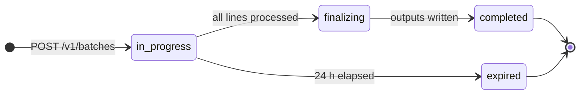

ZeroGPU specifics on top of the OpenAI shape:

- `completion_window` must be `"24h"` (the only supported value).
- The `endpoint` field must be one of the five [supported batch endpoints](/api-reference/batch/supported-endpoints).
- There is **no cancel endpoint** in this release — batches run to completion
  or expire after 24 hours.
- Authentication uses `x-api-key` + `x-project-id` headers.

## Endpoint summary

| Method | Path | Purpose |
|---|---|---|
| POST | `/v1/batches` | Create a new batch from an uploaded JSONL file |
| GET | `/v1/batches` | List batches in this project |
| GET | `/v1/batches/{batch_id}` | Retrieve a single batch (with live counts) |

## Authentication

Every request must include:

```
x-api-key:    <your-api-key>
x-project-id: <your-project-uuid>
```

See [errors.md](/api-reference/batch/errors) for the auth failure codes (`401`, `403`, `420`).

## The Batch object

This is the shape returned by create, retrieve, and inside `data[]` of list.

```json
{
  "id":                "batch_01HZX...",
  "object":            "batch",
  "endpoint":          "/v1/chat/completions",
  "errors":            null,
  "input_file_id":     "file-abc123...",
  "completion_window": "24h",
  "status":            "in_progress",
  "output_file_id":    null,
  "error_file_id":     null,
  "created_at":        1736290000,
  "expires_at":        1736376400,
  "completed_at":      null,
  "failed_at":         null,
  "request_counts": {
    "total":     1500,
    "completed": 0,
    "failed":    0
  },
  "metadata": {
    "job": "nightly-classify"
  }
}
```

### Fields

| Field | Type | Description |
|---|---|---|
| `id` | string | Batch identifier (prefix `batch_`). |
| `object` | string | Always `"batch"`. |
| `endpoint` | string | The endpoint URL every line in this batch targets. |
| `errors` | null | Reserved for OpenAI compatibility — always `null`. |
| `input_file_id` | string | The `file-…` ID you supplied at creation. |
| `completion_window` | string | Always `"24h"`. |
| `status` | string | Lifecycle state. See [Status lifecycle](#status-lifecycle) below. |
| `output_file_id` | string \| null | The file containing successfully completed lines (populated when `status` is `completed`). Download via `GET /v1/files/{id}/content`. |
| `error_file_id` | string \| null | The file containing failed lines (populated when `status` is `completed` and at least one line failed). |
| `created_at` | integer | Unix timestamp (seconds) when the batch was created. |
| `expires_at` | integer | Unix timestamp 24 hours after `created_at`. Anything not finished by this time becomes `expired`. |
| `completed_at` | integer \| null | Unix timestamp when the batch reached a terminal state, or `null` while in progress. |
| `failed_at` | integer \| null | Reserved for OpenAI compatibility — currently always `null`. |
| `request_counts.total` | integer | Total number of lines in the input file. |
| `request_counts.completed` | integer | Lines that completed with a 2xx response. |
| `request_counts.failed` | integer | Lines that failed (HTTP non-2xx, retries exhausted, or other system error). |
| `metadata` | object \| null | Arbitrary JSON you supplied at creation, echoed back unchanged. |

`request_counts.completed + request_counts.failed` equals `total` only when
the batch is terminal.

### Status lifecycle



| Status | Meaning |
|---|---|
| `in_progress` | The batch has been accepted; lines are being processed. The initial state every batch enters after `POST /v1/batches`. |
| `finalizing` | All lines have been processed; the service is writing the output and error files. Brief, transient state. |
| `completed` | Terminal. `output_file_id` (and `error_file_id` if there were failures) are populated. |
| `expired` | Terminal. The 24-hour window elapsed before all lines completed. Whatever finished is still available via `output_file_id` / `error_file_id`. |
| `failed` | Reserved for OpenAI compatibility — not produced by this implementation. |
| `validating` | Reserved for OpenAI compatibility — not produced by this implementation. |

Once a batch reaches `completed` or `expired`, no further state changes occur.

---

## POST `/v1/batches` — Create a batch

Submits a new batch job. The response returns immediately with
`status: "in_progress"` — actual processing happens asynchronously.

### Request

```
POST /v1/batches
Content-Type: application/json
x-api-key:    <key>
x-project-id: <uuid>
```

```json
{
  "input_file_id":     "file-abc123...",
  "endpoint":          "/v1/chat/completions",
  "completion_window": "24h",
  "metadata":          { "job": "nightly-classify" }
}
```

| Field | Required | Description |
|---|---|---|
| `input_file_id` | Yes | The ID of a JSONL file you uploaded with `purpose=batch`. Must exist in this project. |
| `endpoint` | Yes | One of the [supported endpoints](/api-reference/batch/supported-endpoints). Must match the `url` value used by every line in the JSONL file. |
| `completion_window` | No | Must be `"24h"` if provided. Other values are rejected. Defaults to `"24h"`. |
| `metadata` | No | Any JSON object. Echoed back unchanged on retrieve. Useful for tagging batches (job ID, dataset version, etc.). |

<Note>
**ℹ Validation is synchronous; processing is asynchronous**

All input-file and JSONL validation happens before the response returns —
  if it succeeds, the batch is durably committed. Lines are then processed
  asynchronously through an internal queue.
</Note>

### What happens at creation

The server performs all these checks **synchronously** before returning a
response:

1. The input file exists in the project.
2. The JSONL is streamed from storage and validated line by line:
   - Each line is parseable JSON with `custom_id`, `method`, `url`, `body`.
   - `custom_id` values are unique within the batch.
   - All lines share the same `url`, and that `url` matches the `endpoint`
     parameter.
   - No line has `stream: true`.
   - Per-line size ≤ 1 MB; total file size ≤ 200 MB; total lines ≤ 50,000.
3. The batch row is persisted; one queue message is enqueued per line.

Any validation failure returns `400` with the offending `line_idx`. Once the
response returns, the batch is durably committed and processing has begun.

### Response — `200 OK`

A [Batch object](#the-batch-object) with:

- `status: "in_progress"`
- `output_file_id: null`, `error_file_id: null`
- `request_counts: { total: N, completed: 0, failed: 0 }`

### Errors

| Status | Cause |
|---|---|
| `400` | `input_file_id is required` |
| `400` | `endpoint is required` |
| `400` | `completion_window must be "24h"` |
| `400` | `endpoint "X" does not match the url "Y" used by the input file` (when the `endpoint` field disagrees with the `url` in the JSONL) |
| `400` | JSONL validation failure. The error body includes `line_idx` to point at the offending line. |
| `404` | `Input file not found: <file_id>` — the input file is missing, deleted, or in another project. |
| `401` / `403` / `420` / `500` | See [errors.md](/api-reference/batch/errors). |

Validation errors look like:

```json
{
  "error": {
    "message":  "Line 5 duplicates custom_id \"req-1\"",
    "line_idx": 5
  }
}
```

### Example

```bash
curl -X POST https://api.zerogpu.ai/v1/batches \
  -H "x-api-key: $ZGPU_API_KEY" \
  -H "x-project-id: $ZGPU_PROJECT_ID" \
  -H "content-type: application/json" \
  -d '{
    "input_file_id":     "file-abc123...",
    "endpoint":          "/v1/chat/completions",
    "completion_window": "24h",
    "metadata":          { "job": "nightly-classify" }
  }'
```

---

## GET `/v1/batches/{batch_id}` — Retrieve a batch

Returns a single batch with **live counters** if the batch is still
in-progress, or the final snapshot if it has reached a terminal state.

This is the endpoint you poll while waiting for a batch to finish.

### Request

```
GET /v1/batches/{batch_id}
x-api-key:    <key>
x-project-id: <uuid>
```

### Response — `200 OK`

A [Batch object](#the-batch-object). When `status` is `in_progress` or
`finalizing`, the `request_counts` reflect the current real-time progress.

Example mid-flight:

```json
{
  "id":             "batch_01HZX...",
  "status":         "in_progress",
  "input_file_id":  "file-abc123...",
  "output_file_id": null,
  "error_file_id":  null,
  "request_counts": { "total": 1500, "completed": 1342, "failed": 8 },
  ...
}
```

Example after completion:

```json
{
  "id":             "batch_01HZX...",
  "status":         "completed",
  "input_file_id":  "file-abc123...",
  "output_file_id": "file_out_xyz...",
  "error_file_id":  "file_err_xyz...",
  "completed_at":   1736295000,
  "request_counts": { "total": 1500, "completed": 1485, "failed": 15 },
  ...
}
```

### Polling recommendations

- Batches are asynchronous; the first response is always `in_progress`.
- A 30-second poll interval is a reasonable default. You can poll faster for
  small batches.
- The `Retry-After` header is **not** set; pick your own interval.
- Once `status` is `completed`, `expired`, or `failed`, no further state
  changes occur — stop polling.

<Tip>
**✓ Use this endpoint for live counts**

Retrieve returns real-time `request_counts` while a batch is
  running. The list endpoint may lag by a few seconds — for accurate
  progress, retrieve specific batches.
</Tip>

### Errors

| Status | Cause |
|---|---|
| `400` | Missing batch ID. |
| `404` | Batch not found, or belongs to another project. |
| `401` / `403` / `420` / `500` | See [errors.md](/api-reference/batch/errors). |

### Example

```bash
curl https://api.zerogpu.ai/v1/batches/batch_01HZX... \
  -H "x-api-key: $ZGPU_API_KEY" \
  -H "x-project-id: $ZGPU_PROJECT_ID"
```

---

## GET `/v1/batches` — List batches

Returns batches in reverse-chronological order (newest first) with
cursor-based pagination.

### Request

```
GET /v1/batches[?limit=...&after=...]
x-api-key:    <key>
x-project-id: <uuid>
```

| Param | Default | Description |
|---|---|---|
| `limit` | `20` | Number of batches per page. Clamped to `[1, 100]`. |
| `after` | — | Cursor: pass `last_id` from the previous response to get the next page. |

### Response — `200 OK`

```json
{
  "object":   "list",
  "data":     [ { /* Batch object */ }, { /* Batch object */ } ],
  "first_id": "batch_01HZX...",
  "last_id":  "batch_01HZW...",
  "has_more": true
}
```

| Field | Description |
|---|---|
| `object` | Always `"list"`. |
| `data` | Batch objects in newest-first order. |
| `first_id` | The `id` of the first item on the page (or `null` if `data` is empty). |
| `last_id` | The `id` of the last item on the page. Use this as `after` for the next page. |
| `has_more` | `true` if there are more batches beyond this page. |

**Important:** for batches still in flight, `request_counts` returned by the
list endpoint may lag behind the real-time counters. If you need accurate
progress for a specific batch, call `GET /v1/batches/{id}` instead.

### Errors

| Status | Cause |
|---|---|
| `401` / `403` / `420` / `500` | See [errors.md](/api-reference/batch/errors). |

### Example

```bash
# Page 1
curl "https://api.zerogpu.ai/v1/batches?limit=20" \
  -H "x-api-key: $ZGPU_API_KEY" \
  -H "x-project-id: $ZGPU_PROJECT_ID"

# Page 2 (using last_id from the previous response)
curl "https://api.zerogpu.ai/v1/batches?limit=20&after=batch_01HZW..." \
  -H "x-api-key: $ZGPU_API_KEY" \
  -H "x-project-id: $ZGPU_PROJECT_ID"
```

---

## Cancellation

**Not supported in this release.** A `POST /v1/batches/{id}/cancel` endpoint
is not implemented. Once a batch is created it either runs to completion or
expires after 24 hours.

If you need to abandon a batch, simply stop polling — the work will finish or
expire on its own.

## Limits

| Limit | Value |
|---|---|
| Max lines per batch | 50,000 |
| Max total input size | 200 MB |
| Max per-line size | 1 MB |
| Completion window | 24 hours (fixed) |
| Concurrent batches per project | enforced by quota, not by a hard cap |
| Streaming (`stream: true` in line bodies) | rejected at creation |

## After completion

When a batch reaches `status: "completed"`:

- `output_file_id` is set if at least one line returned 2xx. Download with
  `GET /v1/files/{output_file_id}/content`. See
  [jsonl-format.md](/api-reference/batch/jsonl-format#output-jsonl) for the line schema.
- `error_file_id` is set if at least one line failed. Download with
  `GET /v1/files/{error_file_id}/content`. See
  [jsonl-format.md](/api-reference/batch/jsonl-format#error-jsonl) for the line schema.
- Both files have `purpose` `batch_output` and `batch_errors` respectively
  and follow the same 30-day retention policy as your uploads.

When a batch reaches `status: "expired"`, whatever work finished before the
24-hour deadline is still recorded in `output_file_id` and `error_file_id`.
Anything that didn't make it through appears in the error file with
`code: "dlq_exhausted"`.

## Next steps

<CardGroup cols={2}>
  <Card title="JSONL format" href="/api-reference/batch/jsonl-format">
    Exact line schema for input, output, and error files.
  </Card>
  <Card title="Supported endpoints" href="/api-reference/batch/supported-endpoints">
    Per-endpoint request body and response body for all 5 supported URLs.
  </Card>
  <Card title="Errors reference" href="/api-reference/batch/errors">
    Every HTTP status, every validation message, every JSONL error code.
  </Card>
</CardGroup>

