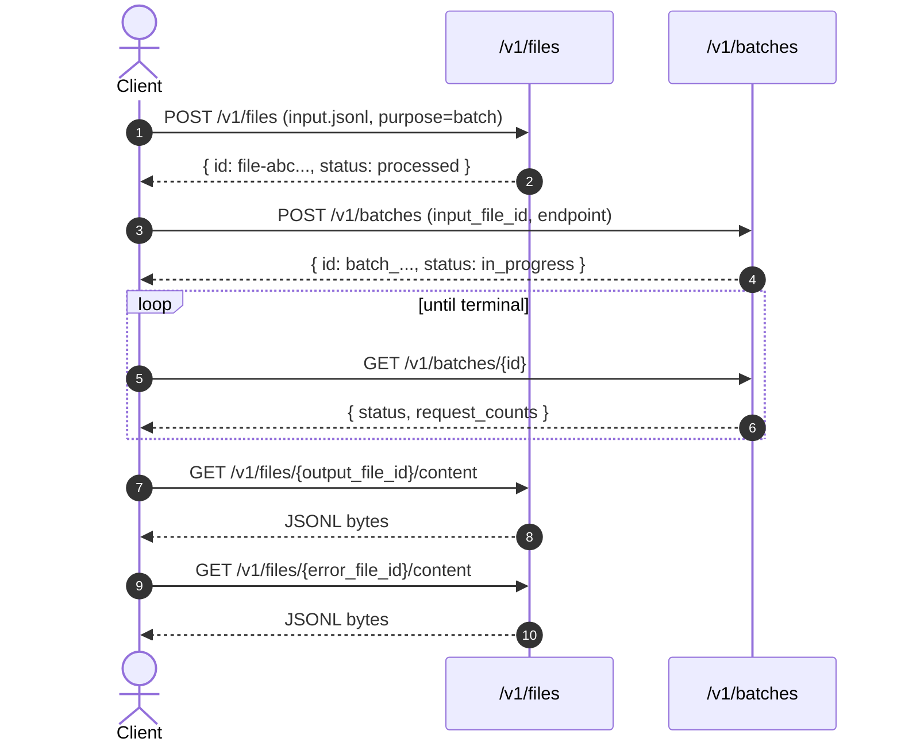

This page walks through a complete batch from start to finish in both `curl`
and the Python `openai` SDK. By the end you'll have submitted 3 chat
completions through the Batch API and read the results.

## Prerequisites

| Credential | Where to find it |
|---|---|
| **API key** (`x-api-key`) | ZeroGPU dashboard → API Keys |
| **Project ID** (`x-project-id`) | ZeroGPU dashboard → Projects |

Both headers are required on every request. Missing either returns `401`.

<Warning>

**Keep your API key out of source control**

Store it in environment variables, secret managers, or your CI's secret
  store, never commit it.

</Warning>

```bash
export ZGPU_API_KEY="your-api-key"
export ZGPU_PROJECT_ID="your-project-uuid"
```

## Base URLs

| Environment | URL |
|---|---|
| Production | `https://api.zerogpu.ai` |
| Staging | `https://staging.api.zerogpu.ai` |
| Development | `https://dev.api.zerogpu.ai` |

The Batch and Files endpoints live under these hostnames:

- `POST   /v1/files`, `GET /v1/files`, `GET /v1/files/{id}`, `GET /v1/files/{id}/content`, `DELETE /v1/files/{id}`
- `POST   /v1/batches`, `GET /v1/batches`, `GET /v1/batches/{batch_id}`

## End-to-end flow



---

## 1. Build the input JSONL

Every batch is driven by a JSONL file where each line is one inference
request:

```json
{"custom_id": "req-1", "method": "POST", "url": "/v1/chat/completions", "body": { ... }}
```

| Field | Required | Description |
|---|---|---|
| `custom_id` | Yes | Your identifier for the request. Must be **unique within the batch**. Echoed back in the output so you can match results to inputs. |
| `method` | Yes | Must be `"POST"`. |
| `url` | Yes | Must be `/v1/chat/completions`, the only [supported batch endpoint](/api-reference/batch/supported-endpoints). All lines in a batch must share the same `url`. |
| `body` | Yes | The JSON body you would send to that endpoint synchronously. `"stream": true` is rejected, batches are non-streaming. |

Full schema and validation rules: [JSONL format](/api-reference/batch/jsonl-format).

<!-- tabs:start -->

#### **bash**

```bash
cat > input.jsonl <<'EOF'
{"custom_id":"q-1","method":"POST","url":"/v1/chat/completions","body":{"model":"<model-id>","messages":[{"role":"user","content":"What is the capital of France?"}]}}
{"custom_id":"q-2","method":"POST","url":"/v1/chat/completions","body":{"model":"<model-id>","messages":[{"role":"user","content":"What is the capital of Germany?"}]}}
{"custom_id":"q-3","method":"POST","url":"/v1/chat/completions","body":{"model":"<model-id>","messages":[{"role":"user","content":"What is the capital of Italy?"}]}}
EOF
```

#### **Python**

```python
import json

questions = [
    ("q-1", "What is the capital of France?"),
    ("q-2", "What is the capital of Germany?"),
    ("q-3", "What is the capital of Italy?"),
]

with open("input.jsonl", "w") as f:
    for custom_id, question in questions:
        f.write(json.dumps({
            "custom_id": custom_id,
            "method":    "POST",
            "url":       "/v1/chat/completions",
            "body": {
                "model":    "<model-id>",
                "messages": [{"role": "user", "content": question}],
            },
        }) + "\n")
```

<!-- tabs:end -->

## 2. Upload the file

Send the JSONL to `POST /v1/files` with `purpose=batch`. The response
contains the `file_id` you'll reference when creating the batch.

<!-- tabs:start -->

#### **curl**

```bash
curl -X POST https://api.zerogpu.ai/v1/files \
  -H "x-api-key: $ZGPU_API_KEY" \
  -H "x-project-id: $ZGPU_PROJECT_ID" \
  -F purpose=batch \
  -F file=@input.jsonl
```

#### **Python**

```python
from openai import OpenAI

client = OpenAI(
    api_key="ignored-by-zerogpu",
    base_url="https://api.zerogpu.ai/v1",
    default_headers={
        "x-api-key":    os.environ["ZGPU_API_KEY"],
        "x-project-id": os.environ["ZGPU_PROJECT_ID"],
    },
)

uploaded = client.files.create(
    file=open("input.jsonl", "rb"),
    purpose="batch",
)
print(uploaded.id)  # file-abc...
```

<!-- tabs:end -->

Response:

```json
{
  "id":         "file-abc123...",
  "object":     "file",
  "bytes":      612,
  "created_at": 1736290000,
  "filename":   "input.jsonl",
  "purpose":    "batch",
  "status":     "processed",
  "expires_at": 1738882000
}
```

## 3. Create the batch

Submit the batch with the file ID, the target endpoint, and a 24-hour
completion window. The response returns immediately with
`status: "in_progress"`, actual processing is asynchronous.

<!-- tabs:start -->

#### **curl**

```bash
curl -X POST https://api.zerogpu.ai/v1/batches \
  -H "x-api-key: $ZGPU_API_KEY" \
  -H "x-project-id: $ZGPU_PROJECT_ID" \
  -H "content-type: application/json" \
  -d '{
    "input_file_id":     "file-abc123...",
    "endpoint":          "/v1/chat/completions",
    "completion_window": "24h"
  }'
```

#### **Python**

```python
batch = client.batches.create(
    input_file_id=uploaded.id,
    endpoint="/v1/chat/completions",
    completion_window="24h",
    metadata={"job": "capitals-demo"},
)
print(batch.id, batch.status)  # batch_01HZX... in_progress
```

<!-- tabs:end -->

Response:

```json
{
  "id":             "batch_01HZX...",
  "object":         "batch",
  "endpoint":       "/v1/chat/completions",
  "status":         "in_progress",
  "input_file_id":  "file-abc123...",
  "output_file_id": null,
  "error_file_id":  null,
  "created_at":     1736290000,
  "expires_at":     1736376400,
  "request_counts": { "total": 3, "completed": 0, "failed": 0 }
}
```

<Note>

**Validation runs at create time**

The server streams the entire input JSONL and validates every line before
  responding. If anything is wrong, duplicate <code>custom_id</code>, line
  over 1 MB, <code>stream: true</code>, mismatched <code>url</code>, you'll
  get a 400 with the offending <code>line</code>. Once the response
  returns, the batch is durably committed.

</Note>

## 4. Poll until complete

Poll `GET /v1/batches/{batch_id}` until `status` is `completed`, `expired`,
or `failed`. A 30-second interval is a reasonable default.

<!-- tabs:start -->

#### **curl**

```bash
while true; do
  RESP=$(curl -s "https://api.zerogpu.ai/v1/batches/$BATCH_ID" \
    -H "x-api-key: $ZGPU_API_KEY" \
    -H "x-project-id: $ZGPU_PROJECT_ID")
  STATUS=$(echo "$RESP" | jq -r '.status')
  echo "$RESP" | jq -c '{status, request_counts}'
  case "$STATUS" in completed|failed|expired) break;; esac
  sleep 30
done
```

#### **Python**

```python
import time

while batch.status not in ("completed", "failed", "expired"):
    time.sleep(30)
    batch = client.batches.retrieve(batch.id)
    print(batch.status, batch.request_counts)
```

<!-- tabs:end -->

When `status` is `completed`, the response contains `output_file_id` (and,
if any line failed, `error_file_id`).

## 5. Download the results

Stream the output and error files via `GET /v1/files/{file_id}/content`.

<!-- tabs:start -->

#### **curl**

```bash
curl -s "https://api.zerogpu.ai/v1/files/$OUTPUT_FILE_ID/content" \
  -H "x-api-key: $ZGPU_API_KEY" \
  -H "x-project-id: $ZGPU_PROJECT_ID" \
  -o output.jsonl

jq -r '"\(.custom_id): \(.response.body.choices[0].message.content)"' output.jsonl
```

#### **Python**

```python
if batch.output_file_id:
    data = client.files.content(batch.output_file_id).read()
    with open("output.jsonl", "wb") as f:
        f.write(data)

    for line in data.decode().splitlines():
        rec = json.loads(line)
        print(rec["custom_id"], rec["response"]["body"]["choices"][0]["message"]["content"])
```

<!-- tabs:end -->

Output line shape (one per successful line, order **not preserved**, match
by `custom_id`):

```json
{"id": "batch_req_a", "custom_id": "q-1", "response": {"status_code": 200, "request_id": "req_xyz", "body": { ... }}}
```

Error line shape (one per failed line):

```json
{"id": "batch_req_b", "custom_id": "q-2", "response": null, "error": {"code": "invalid_request_error", "message": "[legacy:http_400] ...", "param": null}}
```

Full schemas: [JSONL format](/api-reference/batch/jsonl-format).

## Next steps

<CardGroup cols={2}>
  <Card title="JSONL format →" href="/api-reference/batch/jsonl-format">
    Exact line schema for input, output, and error files.
  </Card>
  <Card title="Supported endpoints →" href="/api-reference/batch/supported-endpoints">
    Body and response shape for <code>/v1/chat/completions</code>.
  </Card>
  <Card title="Batches API reference →" href="/api-reference/batch/batches-api">
    Status lifecycle, limits, full Batch object schema.
  </Card>
  <Card title="More examples →" href="/api-reference/batch/examples">
    Full Python script, plus a realistic IAB-classification batch.
  </Card>
</CardGroup>
