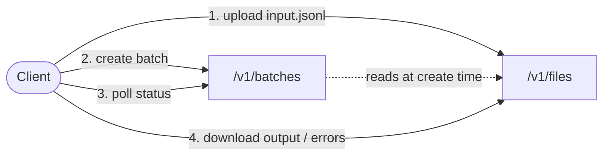

The Batch API processes hundreds, thousands, or up to 50,000 inference
requests at a discounted rate and within a 24-hour window. It's the right
choice when you don't need a real-time response and want to avoid per-request
rate limits.

<CardGroup cols={2}>
  <Card title="Quickstart" href="/api-reference/batch/getting-started">
    First batch in under 10 minutes — auth, upload, create, download.
  </Card>
  <Card title="JSONL format" href="/api-reference/batch/jsonl-format">
    Mandatory input line schema, output schema, error schema, and validation rules.
  </Card>
  <Card title="Supported endpoints" href="/api-reference/batch/supported-endpoints">
    The five endpoints you can target from a batch and the body / response shape of each.
  </Card>
  <Card title="Examples" href="/api-reference/batch/examples">
    End-to-end walkthroughs in `curl` and the Python `openai` SDK.
  </Card>
</CardGroup>

## How it works

Every batch follows the same four-step lifecycle:

1. **Upload** a JSONL input file via `POST /v1/files`.
2. **Create** the batch via `POST /v1/batches`, referencing the file ID.
3. **Poll** `GET /v1/batches/{id}` until `status` is `completed` (or
   `expired`).
4. **Download** the output and error files via
   `GET /v1/files/{id}/content`.

## Quick facts

| | |
|---|---|
| **Base URL (production)** | `https://api.zerogpu.ai` |
| **Auth headers** | `x-api-key`, `x-project-id` |
| **Completion window** | 24 hours (fixed) |
| **Supported batch endpoints** | `/v1/chat/completions`, `/v1/responses`, `/summary`, `/usecase/classify/iab`, `/gliner` |
| **Max requests per batch** | 50,000 |
| **Max input file size** | 200 MB total, 1 MB per line |
| **Max upload size** | 100 MB |
| **File retention** | 30 days |

## When to use the Batch API

| You need… | Use |
|---|---|
| A single immediate response | The synchronous endpoint directly (e.g. `POST /v1/chat/completions`) |
| Hundreds-to-thousands of completions, can wait minutes-to-hours | The Batch API |
| To avoid per-second rate limits during a backfill | The Batch API |
| Streaming responses | The synchronous endpoint — streaming is **not** supported in batch mode |

## Go deeper

<CardGroup cols={2}>
  <Card title="Files API reference" href="/api-reference/batch/files-api">
    Upload, list, retrieve, download, delete — every endpoint, every parameter.
  </Card>
  <Card title="Batches API reference" href="/api-reference/batch/batches-api">
    Create, list, retrieve — including the full Batch object schema and lifecycle.
  </Card>
  <Card title="Errors reference" href="/api-reference/batch/errors">
    Every HTTP status, every validation message, every code that can appear in the error JSONL.
  </Card>
</CardGroup>

