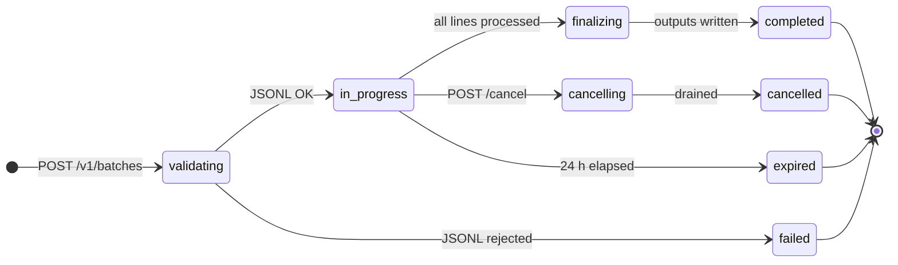

The Batch and Files APIs share one data model. You upload an input **file**,
create a **batch** that points at it, and when the batch finishes the service
writes result and error **files** back. This page describes those two objects,
the lifecycle a batch moves through, and where each endpoint lives.

For request and response details, every endpoint has an interactive page under
**API Reference**, linked from the tables below. To run a batch end to end,
start with the [Quickstart](/docs/batch/getting-started).

## Authentication

Both APIs authenticate with headers, not a bearer token:

```
x-api-key:    <your-api-key>
x-project-id: <your-project-uuid>
```

Missing either header returns `401`; a key that is invalid, inactive, or does
not belong to the supplied project returns `403`; an organization with no
balance and no free credits returns `429` with `insufficient_quota`. See the
[Errors reference](/docs/batch/errors) for the complete list.

## Endpoints

The Files API stores the JSONL that drives a batch:

| Method | Path | Reference |
|---|---|---|
| `POST` | `/v1/files` | [Upload file](/api-reference/batch/upload-file) |
| `GET` | `/v1/files` | [List files](/api-reference/batch/list-files) |
| `GET` | `/v1/files/{file_id}` | [Retrieve file](/api-reference/batch/retrieve-file) |
| `GET` | `/v1/files/{file_id}/content` | [Download file](/api-reference/batch/download-file) |
| `DELETE` | `/v1/files/{file_id}` | [Delete file](/api-reference/batch/delete-file) |

The Batches API submits and monitors the jobs:

| Method | Path | Reference |
|---|---|---|
| `POST` | `/v1/batches` | [Create batch](/api-reference/batch/create-batch) |
| `GET` | `/v1/batches` | [List batches](/api-reference/batch/list-batches) |
| `GET` | `/v1/batches/{batch_id}` | [Retrieve batch](/api-reference/batch/retrieve-batch) |
| `POST` | `/v1/batches/{batch_id}/cancel` | [Cancel batch](/api-reference/batch/cancel-batch) |

Both APIs are wire-compatible with OpenAI's `/v1/files` and `/v1/batches`, so
the official SDKs work once pointed at the ZeroGPU base URL. The ZeroGPU
specifics are: `completion_window` must be `"24h"`, `endpoint` must be
`/v1/chat/completions` (the only [batchable endpoint](/docs/batch/supported-endpoints)),
files are soft-deleted, and error files carry an `is_error` flag (below).

## The File object

Returned by upload and retrieve, and inside `data[]` on list.

```json
{
  "id":         "file-abc123...",
  "object":     "file",
  "bytes":      12345,
  "created_at": 1736290000,
  "filename":   "input.jsonl",
  "purpose":    "batch",
  "status":     "processed",
  "expires_at": 1738882000
}
```

| Field | Type | Description |
|---|---|---|
| `id` | string | File identifier, always prefixed `file-`. Legacy `file_` ids written before the prefix was normalised remain resolvable. |
| `object` | string | Always `"file"`. |
| `bytes` | integer | Size in bytes measured by the server after upload. |
| `created_at` | integer | Unix timestamp (seconds). |
| `filename` | string | The filename you uploaded, or `{file_id}.jsonl` if none was supplied. |
| `purpose` | string | `"batch"` for uploads; `"batch_output"` for both result and error files the service writes. |
| `status` | string | `"processed"` today. The wider `uploaded` / `processed` / `error` union matches OpenAI's published type for forward compatibility. |
| `expires_at` | integer \| omitted | When the file is removed. Uploads expire 30 days after upload; may be absent on server-written files. |
| `is_error` | boolean \| omitted | ZeroGPU extension. Present and `true` only on the error file referenced by `Batch.error_file_id`. OpenAI SDKs ignore it unless explicitly read. |

Output and error files are both written with `purpose: "batch_output"`; the
`is_error: true` flag is what distinguishes the error file when you
`GET /v1/files?purpose=batch_output`.

## The Batch object

Returned by create, retrieve, and cancel, and inside `data[]` on list.

```json
{
  "id":                "batch_01HZX...",
  "object":            "batch",
  "endpoint":          "/v1/chat/completions",
  "errors":            null,
  "input_file_id":     "file-abc123...",
  "completion_window": "24h",
  "status":            "in_progress",
  "output_file_id":    null,
  "error_file_id":     null,
  "created_at":        1736290000,
  "in_progress_at":    1736290001,
  "expires_at":        1736376400,
  "finalizing_at":     null,
  "completed_at":      null,
  "failed_at":         null,
  "expired_at":        null,
  "cancelling_at":     null,
  "cancelled_at":      null,
  "request_counts":    { "total": 1500, "completed": 0, "failed": 0 },
  "metadata":          { "job": "nightly-classify" }
}
```

| Field | Type | Description |
|---|---|---|
| `id` | string | Batch identifier, prefix `batch_`. |
| `object` | string | Always `"batch"`. |
| `endpoint` | string | The endpoint every line in this batch targets. |
| `errors` | object \| null | When `status` is `failed`, holds `{ object: "list", data: [BatchError] }` describing the validation failure. Each `BatchError` is `{ code, message, line, param }`. `null` otherwise. |
| `input_file_id` | string | The `file-` id you supplied at creation. |
| `completion_window` | string | Always `"24h"`. |
| `status` | string | Lifecycle state, see below. |
| `output_file_id` | string \| null | File of successfully completed lines, populated when `status` is `completed`. Download via `GET /v1/files/{id}/content`. |
| `error_file_id` | string \| null | File of failed lines, populated when at least one line failed. Listed with `purpose: "batch_output"`, `is_error: true`. |
| `created_at` | integer | When the batch was created. |
| `in_progress_at` | integer \| null | When validation finished and processing started. |
| `expires_at` | integer | 24 hours after `created_at`; anything unfinished by then becomes `expired`. |
| `finalizing_at` | integer \| null | When all lines finished and the output files began writing. |
| `completed_at` / `failed_at` / `expired_at` / `cancelling_at` / `cancelled_at` | integer \| null | Timestamps for each terminal or transitional state; `null` until reached. |
| `request_counts` | object | `{ total, completed, failed }`. `completed + failed` equals `total` only once the batch is terminal. |
| `metadata` | object | Arbitrary JSON you supplied at creation, echoed back unchanged. Empty `{}` when omitted, never `null`. |

## Status lifecycle



| Status | Meaning |
|---|---|
| `validating` | Row persisted; the JSONL is being streamed and validated synchronously. Transient. |
| `in_progress` | Validation succeeded; lines are being processed. |
| `finalizing` | All lines processed; output and error files are being written. Transient. |
| `completed` | Terminal. `output_file_id` (and `error_file_id` if any line failed) are populated. |
| `failed` | Terminal. JSONL validation rejected the input; `errors` holds the offending line(s). Still retrievable so SDKs can introspect. |
| `expired` | Terminal. The 24-hour window elapsed first. Whatever finished is in `output_file_id` / `error_file_id`; the rest is in the error file with `code: "batch_expired"`. |
| `cancelling` | Cancellation requested. Dispatched lines finish; pending lines are short-circuited to the error file with `code: "batch_cancelled"`. |
| `cancelled` | Terminal. Cancellation drained; files reflect whatever processed before the request. |

Validation is **synchronous**, processing is **asynchronous**: the create call
returns only after the JSONL passes (or fails) validation, and lines are then
worked through an internal queue. Once a batch is terminal, no further state
changes occur, so stop polling. Retrieve returns live `request_counts`; the
list endpoint may lag by a few seconds, so poll a specific batch for accurate
progress.

## Reading results

When `status` is `completed`:

- `output_file_id` is set if any line returned 2xx. Download it and match
  results to inputs by `custom_id`, order is not preserved.
- `error_file_id` is set if any line failed. Partition by `error.code` to
  decide what to retry.

Both files follow the same 30-day retention as your uploads, and the line
schemas live in [JSONL format](/docs/batch/jsonl-format). Deleting an input
file does not stop a running batch, the input is read at creation time. For
size and rate limits, see the [Overview](/docs/batch) quick facts.

## Next steps

<CardGroup cols={2}>
  <Card title="JSONL format →" href="/docs/batch/jsonl-format">
    Exact line schema for input, output, and error files.
  </Card>
  <Card title="Errors reference →" href="/docs/batch/errors">
    Every status, validation message, and error-file code, with recovery steps.
  </Card>
</CardGroup>
